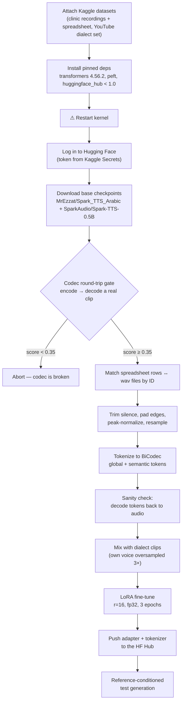

# 🦷🎙️ Egyptian Dental Clinic Voice — Spark-TTS Fine-Tune


LoRA fine-tune of an Arabic Spark-TTS checkpoint on real Egyptian-Arabic dental-clinic
recordings, so a clinic voice assistant speaks in the clinic's own voice and dialect
instead of generic Modern Standard Arabic.

## Table of contents

- [Overview](#overview)
- [Pipeline](#pipeline)
- [What's in this repo](#whats-in-this-repo)
- [Requirements](#requirements)
- [Quickstart](#quickstart-kaggle)
- [Configuration](#configuration)
- [The data](#the-data)
- [Training](#training)
- [Current status](#current-status)
- [Known issues & fixes](#known-issues--fixes)
- [Project history](#project-history)
- [Credits](#credits)

## Overview

The goal is a text-to-speech voice that sounds like an Egyptian dental clinic
receptionist — not a generic Arabic TTS voice. The approach is a single-stage
**LoRA fine-tune** on top of [`MrEzzat/Spark_TTS_Arabic`](https://huggingface.co/MrEzzat/Spark_TTS_Arabic)
(Spark-TTS-0.5B already adapted to Arabic), using:

- **~600 real dental-clinic recordings**, matched to a spreadsheet script by ID.
- A small amount of **Egyptian dialect coverage** pulled from a public Kaggle dataset,
  mixed in at a controlled ratio so it doesn't drown out the clinic's own voice.
- The **BiCodec** audio tokenizer from [Spark-TTS](https://github.com/SparkAudio/Spark-TTS),
  which turns audio into discrete tokens the language model can learn to predict.

An earlier version of this project trained in three sequential stages (Arabic literacy →
Egyptian dialect → clinic voice). That approach was abandoned in favor of this simpler
single-stage setup — see [Project history](#project-history).

## Pipeline



Two manual checkpoints are built into the notebook on purpose: the **codec gate** and the
**pre-training sanity check**. Both require *listening* to the audio before continuing —
if the round-trip doesn't sound like the original recording, no amount of training will fix it.

## What's in this repo

```
.
├── dental-voice-training.ipynb        # this notebook — data prep + LoRA fine-tuning
├── dental-voice-load-and-test.ipynb   # loads the pushed model, inference-only testing
└── README.md
```

## Requirements

- A Kaggle Notebook with GPU (P100/T4) enabled.
- A Hugging Face account + access token, stored as the Kaggle secret `HF_TOKEN`.
- Two datasets attached via **Add Input**:
  1. Your recordings + spreadsheet (own Kaggle dataset).
  2. [`ahmedshafiq12/egyptian-audio-dataset-collected-from-youtube`](https://www.kaggle.com/datasets/ahmedshafiq12/egyptian-audio-dataset-collected-from-youtube)
     for dialect coverage.
- Everything else (transformers, peft, the Spark-TTS repo, etc.) is installed by the
  notebook itself.

## Quickstart (Kaggle)

1. Attach both datasets listed above via **Add Input**.
2. Add your Hugging Face token as a Kaggle secret named `HF_TOKEN`.
3. Run the install cell, then **Run → Restart & clear cell outputs** — the pinned
   `transformers` version only takes effect in a fresh process.
4. Run the remaining cells top to bottom. Stop and *listen* at:
   - the **codec gate** (round-trip must sound like the original), and
   - the **pre-training sanity check** (decoded training tokens must sound right).
5. Training runs, then the LoRA adapter + tokenizer are pushed to the Hub.
6. The final cells generate test sentences and a memorization check.

## Configuration

All knobs live in one `CONFIG` cell at the top of the notebook.

| Setting | Value | Purpose |
|---|---|---|
| `ARABIC_BASE_REPO` | `MrEzzat/Spark_TTS_Arabic` | Base checkpoint (Arabic-tuned) |
| `SPARK_BASE_REPO` | `SparkAudio/Spark-TTS-0.5B` | Fallback codec source |
| `TRIM_TOP_DB` | `40` | Silence-trim threshold (raised from 30 to stop cutting into word onsets) |
| `EDGE_PAD_SEC` | `0.15` | Silence padding re-added after trim |
| `CODEC_MIN_SCORE` | `0.35` | Minimum round-trip score to pass the codec gate |
| `USE_EXTRA_DIALECT` | `True` | Whether to mix in the YouTube dialect data |
| `EXTRA_MAX_CLIPS` | `1200` | Cap on dialect clips, so they don't dominate the mix |
| `EXTRA_MIN_SEC` / `EXTRA_MAX_SEC` | `1.5` / `12.0` | Duration filter for dialect clips |
| `OWN_OVERSAMPLE` | `3` | Repeats of your own clips, so your voice isn't outnumbered |
| `NUM_EPOCHS` | `3` | Training epochs |
| `LEARNING_RATE` | `2e-4` | LoRA learning rate |
| `BATCH_SIZE` / `GRAD_ACCUM` | `2` / `4` | Effective batch size 8 |
| `MAX_SEQ_LEN` | `2048` | Truncation length for tokenized training text |
| `MAX_GEN_TOKENS` | `700` | Generation cap at inference time |

## The data

**Your recordings** — the corrected ~600-clip set (folder `fixed600`), where each
filename equals its spreadsheet ID for direct matching (a category-prefix scheme is kept
only as a fallback). Audio is clean single-speaker studio-style recordings; the pipeline
trims silence, pads edges, and peak-normalizes before tokenizing. Diacritics cover only a
small fraction of the transcript text, while the base model was trained on fully
diacritized Modern Standard Arabic — a likely contributor to weaker pronunciation on
words outside the training set.

**Dialect data** — a public Kaggle dataset built for speech-to-text from YouTube videos
(audio + subtitles). It's useful for Egyptian-dialect coverage but is *not* clean studio
speech: multiple speakers, background noise/music, and approximate subtitle text. The
pipeline filters by duration and text length and caps the total clip count so it can't
swamp the clinic's own voice.

## Training

LoRA on top of the Arabic checkpoint — full fine-tuning on this little data would destroy
the Arabic ability being built on.

| LoRA config | Value |
|---|---|
| Rank (`r`) | 16 |
| Alpha | 16 |
| Dropout | 0.0 |
| Target modules | `q_proj, k_proj, v_proj, o_proj, gate_proj, up_proj, down_proj` |

Training runs in **fp32** (not fp16 — this model emits zero audio tokens in half
precision), with gradient checkpointing, a linear LR schedule, and no intermediate
checkpoint saves — only the final adapter is pushed to the Hub, as a **private** repo.

Example test sentences used to sanity-check the trained voice:

- `افتح بقك من فضلك` — "open your mouth, please"
- `هرجع أشوفك الأسبوع الجاي` — "I'll come see you next week"
- `الحشو محتاج جلستين بس` — "the filling only needs two sessions"

## Current status

- The codec round-trip passes its gate, confirming BiCodec can faithfully reproduce real
  recordings before any training happens.
- Generated audio is genuine voiced speech (correct pitch periodicity, syllable
  structure) rather than noise.
- A memorization check on a trained sentence confirmed the model **can** learn correct
  content mapping — most of the sentence played back clearly.
- Remaining rough edges: utterance-initial words are sometimes unclear (suspected to be
  silence-trim cutting into the natural onset ramp), and greedy decoding can loop near
  the token cap instead of stopping cleanly (see below).
- Not yet solved: generalization to novel sentences outside the training set.

## Known issues & fixes

| Issue | Symptom | Fix |
|---|---|---|
| Mixed `transformers` versions in one env | `ImportError` / `cannot import name ...` | `rmtree` the package dir (not `pip uninstall`) and restart the kernel |
| Half precision on this checkpoint | Zero audio tokens generated | Load and train in `torch_dtype=torch.float32` |
| `huggingface_hub` ≥ 1.0 | Incompatible with pinned `transformers==4.56.2` | Pin `huggingface_hub>=0.34.0,<1.0` |
| Greedy decoding near `MAX_GEN_TOKENS` | Output loops on a repeating token cycle instead of stopping | Add `repetition_penalty` and `no_repeat_ngram_size` to `model.generate(...)` |
| Spreadsheet ID reused across categories | Silent under-matching of recordings to text | ID-first matching with a category-prefix fallback, plus a hard-guard against near-miss match rates |

## Project history

- Started as a **3-stage** fine-tune (Arabic literacy → Egyptian dialect → clinic voice)
  chained across separate datasets and Hub checkpoints.
- Abandoned in favor of a **single-stage LoRA** on top of an already Arabic-tuned
  checkpoint — simpler, and it sidesteps a 20 GB Kaggle disk ceiling that the dialect
  dataset alone couldn't fit alongside the base model.
- A codec round-trip test caught that the audio tokenizer itself was producing noise on
  encode/decode — every training token up to that point had been garbage, independent of
  any training bug.
- A spreadsheet ID collision (`C-` used for two different categories) was found to have
  silently mismatched roughly a third of recordings to the wrong transcript text.
- After fixing the codec, the matching, and a silence-trim threshold that was cutting
  into word onsets, generated audio changed from noise to genuine speech with correct
  content mapping.

## Credits

- Base model: [`MrEzzat/Spark_TTS_Arabic`](https://huggingface.co/MrEzzat/Spark_TTS_Arabic)
- Codec fallback: [`SparkAudio/Spark-TTS-0.5B`](https://huggingface.co/SparkAudio/Spark-TTS-0.5B)
- Codec/model code: [SparkAudio/Spark-TTS](https://github.com/SparkAudio/Spark-TTS)
- Dialect data: [`ahmedshafiq12/egyptian-audio-dataset-collected-from-youtube`](https://www.kaggle.com/datasets/ahmedshafiq12/egyptian-audio-dataset-collected-from-youtube)

> Base models and datasets each carry their own license terms — check those before any
> public release of this fine-tune.
